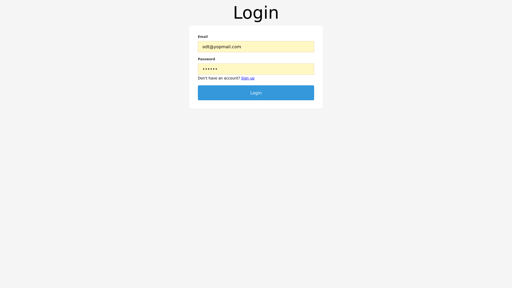
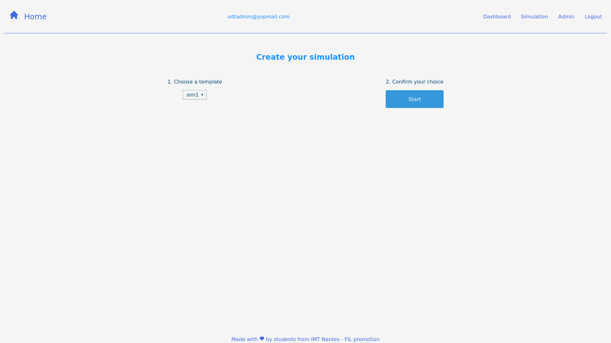
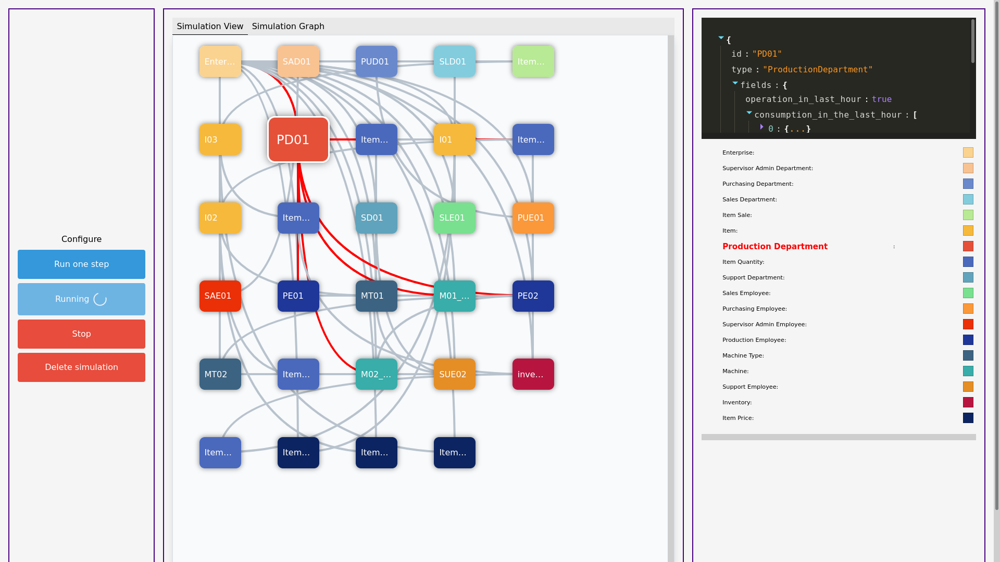
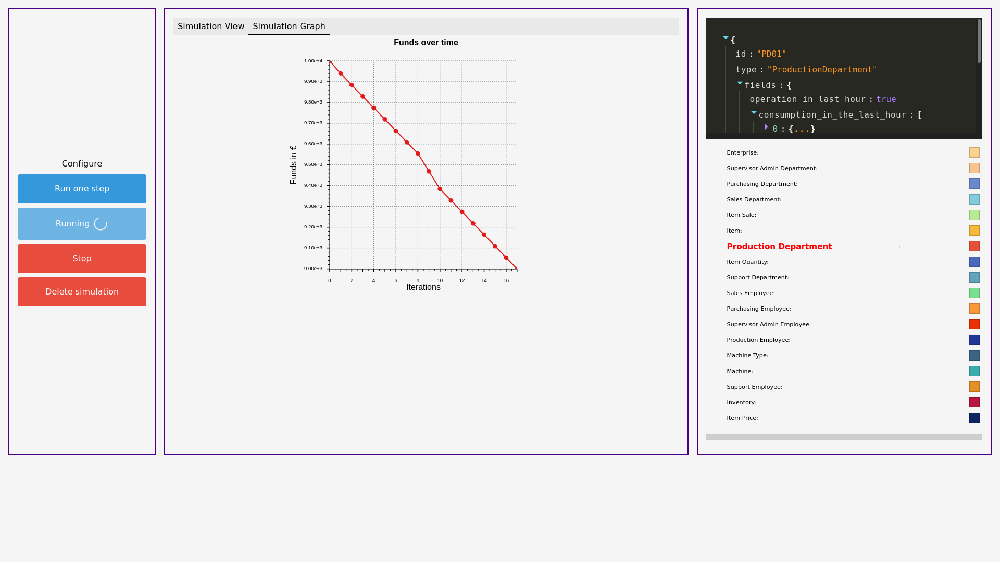
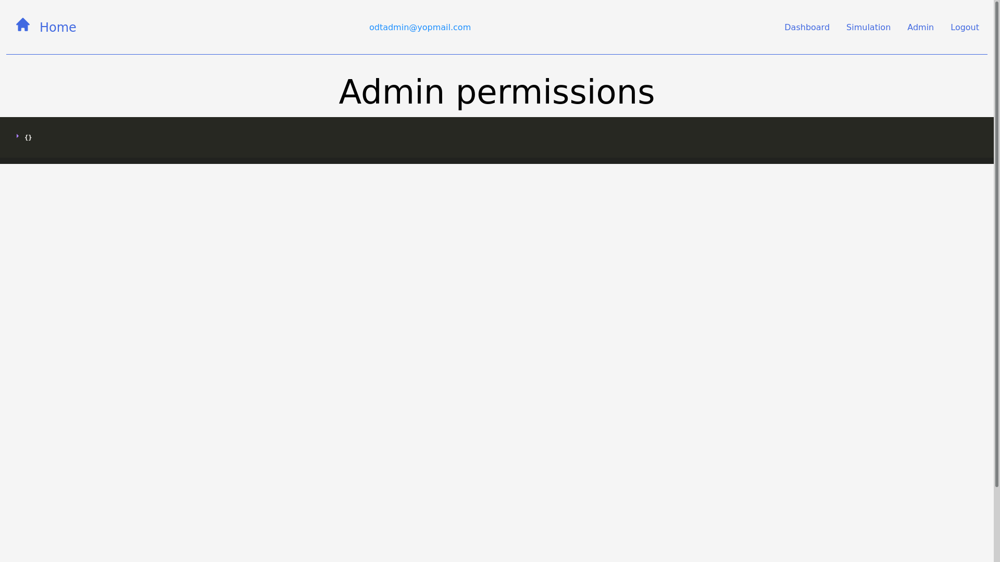

# Web-based simulation

Tutor : Remous Aris Koutsiamanis ([remous-aris.koutsiamanis@imt-atlantique.fr](mailto:remous-aris.koutsiamanis@imt-atlantique.fr))

## Objective

The objective of this project is to gain experience in designing, creating and interacting with web APIs, data processing and visualization libraries to present an interactive an interactive data dashboard.

## Context, problematic

The project is in the context of a web-based discrete event simulator that can be used in teaching computer science students.

The simulated subject will be a simple company (raw materials, production machines, personnel, manufactured products, costs, profits, etc.) but the developed system should be general enough to be easily modified and extended to work with similarly structured simulators on other subjects. The simulator itself will be provided by the tutor.

The work involves both the server side and the client side of an application. Specifically, the server side creates, manages, and provides access to the simulation while providing a REST API to access the simulation and these management features.

The client side accesses the REST API to manage and interact with the simulation and uses it to allow users to interact and display information about the simulation in a web browser.

The functionality that should be provided is:

- Create, start, stop a simulation.
- Configure simulation parameters.
- Store simulation configuration parameters (in a simple database) to allow replay of the exact same simulation.
- Retrieve live information by polling (client pull) and continuously (server push).
- Present/display information using interactive graphics (for the given simulator example).
- Interact with the simulation (request and apply changes).
- Provide authenticated access to users (stored in a database).
  - A minimum of two user categories are required for each simulation:
    - Simulation owners can create, modify, delete, start,
      stop and interact (receive information, request changes to be made during execution) with
      The simulation owners can create, modify, delete, start, stop and interact (receive information, request changes to be made during execution) with the simulation.
    - Simulation users can only interact with a simulation.

As part of these steps, students will need to decide on a flexible way to represent entities in the simulation and make them
entities in the simulation and make them accessible via the REST API.

## Phases and Deliverables

### Sprint 1

- Design:
  - The representation of the simulation model and possible interactions with it:
    - Create, start, stop, change parameters, get information,
      request and apply modifications.
  - Representation of the authentication (users, permissions).
- Implementing :
  - The management of a running simulation in the server.
  - Persistence / storage of simulation information in the server.
  - The REST API.

### Sprint 2

- Implement a web interface to access the REST API.
- Display sample information from the simulation.
- Allow interaction with the simulation.
- Implement authenticated access.

## Technological environment

- Server: **TypeScript and Express** 
  - Database : PostgreSQL.
  - Business simulator: Provided by the tutor.
- Client:  **TypeScript and NextJS**
  - Compatibility with Safari, Firefox and Chrome browsers.

## Deliverables

- Project source code with :
  - Documentation (Swagger).
  - Versioning (Github).
- Improvement proposals.
- Evaluation of results.

## Results

### Front end

#### Login page

To log or to sign into the application.

<p></p>

#### Home page

To choose and create a simulation from a template.

<p></p>

#### Simulation board

To edit the evolution of the simulation and to visualize interactions between its components.

<p></p>

To watch the evolution of the financial founds of the simulation over time.

<p></p>

#### Administration dashboard

To allow or disable modifications of specific variables of the simulation. 

<p></p>

## How to use the app ?

### Downloading the repository

In a terminal, download the repository.

```bash
git clone https://github.com/Naedri/company-simulation.git
cd company-simulation/
```
### Create a database
Create a PostgreSQL database. We recommend using elephantsql.com for convenience. Run the script in server/database/initBase.sql to create the necessary tables. 

#### Local variables

Add the following *.env.local* files in your projet :

1. `company-simulation/server/.env.local`
    - which includes the following ElephantSQL data :
        - `DB_USER=xxx`
        - `DB_HOST=yyyyyyy.db.elephantsql.com`
        - `DB_DATABASE=xxx`
        - `DB_PASSWORD=dddddd`
        - `DB_PORT=5432`
        - `SECRET=your-secret-for-token`
2. `company-simulation/client/.env.local`
    - which includes the following NextJS data :
        - `NEXT_PUBLIC_API_URL=http://localhost:3000`

### Launching the app

#### Launching the server

In a terminal, install dependencies, initialize the database and then launch the server.

```bash
cd ./server/
npm install
npm run start
```
You will need to add NODE_ENV=dev in your environnment variables for local development.
```bash
NODE_ENV=dev npm run start
```
#### Launching the client

In another terminal, install dependencies then launch the client.

```bash
cd ./client/
npm install
npm run dev
```

#### Seeing the result

Open [http://localhost:8080](http://localhost:8080) with your browser to see the result.
After to have been logging, you can read the swagger documentation to the following page : [http://localhost:3000/docs/](http://localhost:3000/docs/). 
